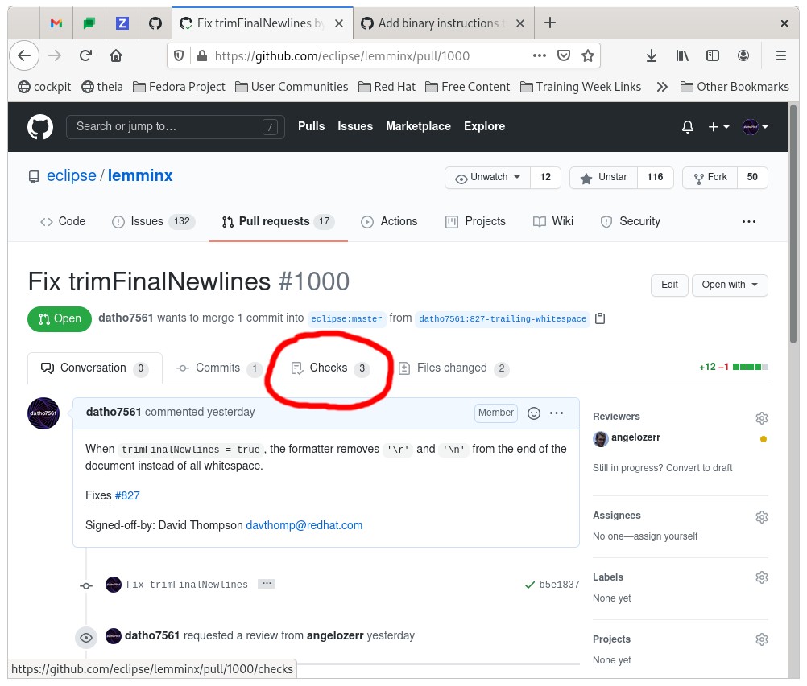
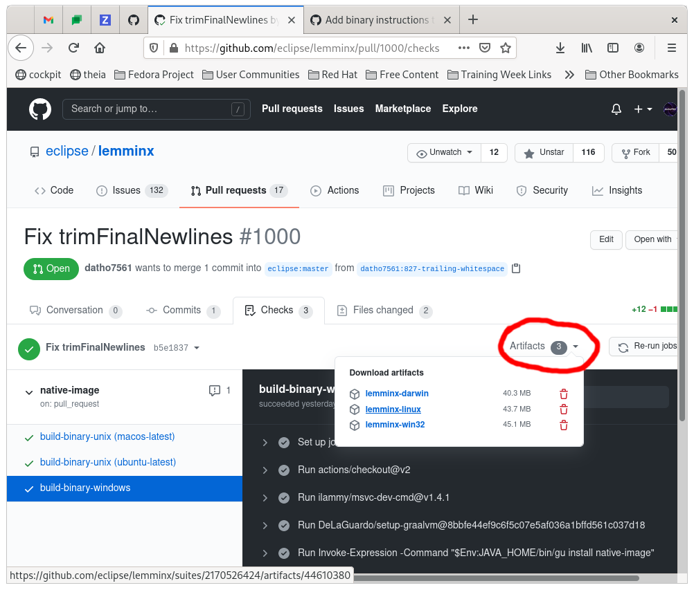

# How to Contribute

Contributions are essential for keeping this extension great. We try to keep it as easy as possible to contribute changes and we are open to suggestions for making it even easier. There are only a few guidelines that we need contributors to follow.

## Development

### Installation Prerequisites:

  * latest [Visual Studio Code](https://code.visualstudio.com/)
  * [Node.js](https://nodejs.org/) v4.0.0 or higher
  * [JDK 8+](http://www.oracle.com/technetwork/java/javase/downloads/index.html)
  * [Maven](https://maven.apache.org/)

### Steps
1. Fork and clone this repository

2. Fork and clone the [LemMinX - XML Language Server ](https://github.com/eclipse/lemminx)

* **Note:** The directory format has to match the following:

  ```
    YOUR_FOLDER/
              ├──── lemminx/
              │
              ├──── vscode-xml/
  ```

3. `cd lemminx/`

4. Install the maven dependencies Mac/Linux:
	```bash
	$ ./mvnw verify
	```
	or for Windows:
	```bash
	$ mvnw.cmd verify
	```


5. `cd vscode-xml/`

6. Install the dependencies:
	```bash
	$ npm install
	```

7. In `vscode-xml/`, build the server by running:

	```bash
	$ npm run build-server
	```

8. To run the extension, open the Debugging tab in VSCode.
9. Select and run 'Launch Extension (vscode-xml)' at the top left:

    

## Binary server development

### Testing a binary version of LemMinX

1. Copy the binary version of LemMinX to:

   | OS | Location (relative to root of repository) |
   | --- | --- |
   | Linux | `./server/lemminx-linux` |
   | macOS | `./server/lemminx-darwin-x86_64` |
   | Windows | `.\server\lemminx-win32.exe` |

   Alternatively, you can set the `xml.server.binary.path` preference to specify the path of the binary to run.

2. Make sure that you set `xml.server.preferBinary` to `true`,
disable any [LemMinX extensions](./docs/Extensions.md)
by commenting out `xml.extension.jars` in your `settings.json`,
and uninstall or disable any VS Code extensions that provide extra LemMinX features.

3. Launch vscode-xml in development mode, and double check that the binary server is running by checking the server logging (Output > XML Support)

### Downloading the GitHub Actions binary for your PR

1. Open the GitHub page for your PR.

2. Click on "Checks":

   

3. Click "Artifacts", then select the binary for your operating system:

   

### Building a binary with GraalVM locally

If you submit a LemMinX PR, GitHub Actions will generate a binary for your PR that you can use for testing.
If you need to generate a LemMinX binary locally for whatever reason, follow these steps:

1. Download and set up [GraalVM and its dependencies](https://www.graalvm.org/docs/getting-started/)
    * either 20.x or 21.x should work
    * The version for Java 11 is preferred, since it is hard to set up GraalVM Java 8 on Windows
2. Make sure that the environment variable `JAVA_HOME` points to the GraalVM installation.
3. Run `./mvnw clean package -DskipTests -Dnative` from the root of the LemMinX repository
    * This will use a lot of memory (> 4 GB) and take a while
4. The binary is generated in `./org.eclipse.lemminx/target`
